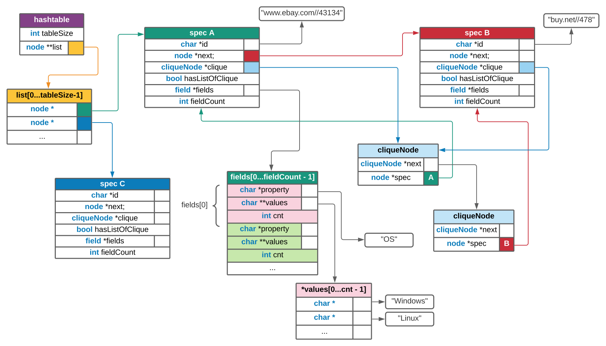

# Project-K23a

## Team Members
Katsouli Ioanna (1115201400067) 
Konomi Marina (1115201700054) 
Leonidas-Panagiotis Papadakos (1115201700117) 

## Data Structures
*A picture is worth a thousand words.*

## Build
Run `make`, to build the executables and unit tests 
To run the testing executables, (found in tests/), run `make check`.

## Usage
`./specs [-e buckets (default: 10007)] -x dataset_x -w dataset_w [-o FILE (default: stdout)]`

## Notes/Assumptions
* The unit testing library used is [acutest](https://github.com/mity/acutest).
* It is assumed that within the directory of `Dataset X`, there will be only site folders (e.g. www.ebay.com) and .json files.
* The way we print the cliques as distinct pairs of specs is outlined in `print_pairs()`, within [hashtable.c](./src/hashtable.c). There was a discussion on this in [this Piazza question](https://piazza.com/class/kfduqabor94zw?cid=11) and verbally, in the weekly Zoom meetings.
* The program outputs to stdout by default, which is also suggested in the aforementioned Piazza discussion. Use `-o somefile.csv` or redirection, to point the data elsewhere.
